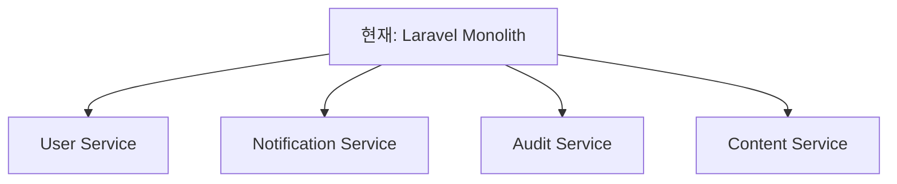

# Snaproom MSA 개선 로드맵

## 📊 현재 상태 분석

**MSA 적합성**: 85% (우수)
**분석 일자**: 2025-07-31
**분석 범위**: snaproom, snaproom-react, snaproom-laravel, snaproom-infrastructure

### 현재 아키텍처 강점
- ✅ Event-Driven Architecture (Kafka)
- ✅ Redis 클러스터링 (Master-Replica-Sentinel)
- ✅ Infrastructure as Code (Terraform)
- ✅ 컨테이너화 및 오케스트레이션
- ✅ Health 모니터링 시스템

### 주요 개선 필요 영역
- ⚠️ 도메인 분리 및 데이터 격리 (70%)
- ⚠️ 배포 및 스케일링 전략 (75%)
- ⚠️ 서비스 메시 및 트래픽 관리
- ⚠️ 분산 트랜잭션 패턴

---

## 🗺️ 3단계 개선 로드맵

### Phase 1: 서비스 분리 기반 구축 (3-6개월)
**목표**: 85% → 90% MSA 적합성

#### 1.1 도메인 기반 서비스 분할
**현재 상태**: 단일 Laravel 애플리케이션
**개선 목표**: 도메인별 마이크로서비스 분리



**구현 계획**:
- [ ] 도메인 경계 식별 및 정의
- [ ] 서비스별 데이터베이스 분리
- [ ] API 인터페이스 설계
- [ ] 이벤트 스키마 정규화

#### 1.2 Database per Service 패턴 적용
**현재**: 단일 PostgreSQL 데이터베이스
**개선**: 서비스별 독립 데이터베이스

```yaml
databases:
  user_service_db:
    engine: PostgreSQL
    purpose: 사용자 인증, 프로필, 권한
    
  notification_service_db:
    engine: PostgreSQL
    purpose: 알림, 메시지, 구독 관리
    
  audit_service_db:
    engine: PostgreSQL
    purpose: 감사 로그, 컴플라이언스
    
  content_service_db:
    engine: PostgreSQL
    purpose: 콘텐츠, 메타데이터
```

#### 1.3 API Gateway 도입
**현재**: 직접 Laravel API 호출
**개선**: 중앙집중식 API Gateway

**권장 솔루션**: Kong Gateway
- 인증/인가 중앙화
- 레이트 리미팅
- 로드 밸런싱
- API 버전 관리

### Phase 2: 고급 MSA 패턴 적용 (6-9개월)
**목표**: 90% → 95% MSA 적합성

#### 2.1 Service Mesh 구현
**선택 기술**: Istio
- 서비스 간 통신 보안
- 트래픽 관리 및 모니터링
- 장애 격리 및 회복

#### 2.2 Saga Pattern 구현
**목적**: 분산 트랜잭션 관리
**패턴**: Choreography-based Saga

```yaml
사용자_가입_Saga:
  steps:
    1. 사용자_계정_생성 (User Service)
    2. 알림_구독_설정 (Notification Service)  
    3. 감사_로그_기록 (Audit Service)
  compensation:
    - 계정_삭제
    - 구독_취소
    - 로그_정리
```

#### 2.3 Event Sourcing 패턴
**현재**: 상태 기반 저장
**개선**: 이벤트 기반 상태 재구성

### Phase 3: 클라우드 네이티브 최적화 (9-12개월)
**목표**: 95%+ 완전한 MSA

#### 3.1 Kubernetes 기반 오케스트레이션
**현재**: Docker Compose
**개선**: Kubernetes 클러스터

#### 3.2 분산 트레이싱
**도구**: Jaeger + OpenTelemetry
- 요청 추적
- 성능 병목 식별
- 의존성 매핑

#### 3.3 Advanced Monitoring
**스택**: Prometheus + Grafana + Alertmanager
- 메트릭 수집 및 시각화
- 자동 알림 시스템
- SLA/SLO 모니터링

---

## 📋 구현 우선순위 매트릭스

| 개선사항 | 비즈니스 임팩트 | 기술적 복잡도 | 구현 우선순위 |
|---------|----------------|---------------|---------------|
| 도메인 서비스 분할 | High | High | P1 (즉시) |
| Database per Service | High | Medium | P1 (즉시) |
| API Gateway | Medium | Low | P2 (3개월) |
| Service Mesh | Medium | High | P3 (6개월) |
| Event Sourcing | Low | High | P4 (9개월) |

---

## 🛠️ 기술 스택 변화

### 현재 기술 스택
```yaml
Frontend: React + TypeScript + FSD
Backend: Laravel + ADR Pattern  
Database: PostgreSQL (단일)
Cache: Redis Cluster
Messaging: Kafka Cluster
Infrastructure: Docker Compose + Terraform
```

### 목표 기술 스택
```yaml
Frontend: React + TypeScript + FSD
Gateway: Kong API Gateway
Services: 
  - User Service (Node.js/Go)
  - Notification Service (Node.js/Python)
  - Audit Service (Go/Java)
  - Content Service (Laravel/Python)
Databases: PostgreSQL (서비스별)
Cache: Redis Cluster
Messaging: Kafka Cluster
Orchestration: Kubernetes
Service Mesh: Istio
Monitoring: Prometheus + Grafana + Jaeger
Infrastructure: Terraform + Helm
```

---

## 📊 성공 지표 (KPIs)

### 기술 지표
- **서비스 독립성**: 서비스별 독립 배포 가능성 100%
- **장애 격리**: 단일 서비스 장애가 전체 시스템에 미치는 영향 < 10%
- **응답 시간**: API 게이트웨이 기준 평균 응답 시간 < 200ms
- **가용성**: 서비스별 99.9% 이상

### 운영 지표  
- **배포 빈도**: 서비스별 일 1회 이상 배포 가능
- **복구 시간**: 장애 발생 시 평균 복구 시간 < 15분
- **모니터링 커버리지**: 모든 서비스 100% 메트릭 수집

---

## 🚨 위험 요소 및 대응 방안

### 주요 위험 요소
1. **데이터 일관성**: 분산 트랜잭션으로 인한 복잡성
2. **네트워크 지연**: 서비스 간 통신 오버헤드
3. **운영 복잡성**: 다수 서비스 관리 부담

### 대응 전략
1. **단계적 마이그레이션**: Big Bang 방식 대신 점진적 전환
2. **충분한 테스트**: 통합 테스트 및 카나리 배포
3. **모니터링 강화**: 실시간 성능 및 오류 추적
4. **롤백 계획**: 각 단계별 롤백 전략 수립

---

## 📅 상세 실행 계획

### Q1 2025: 기반 구축
- [x] MSA 아키텍처 분석 완료
- [ ] 도메인 경계 정의 및 서비스 설계
- [ ] 첫 번째 마이크로서비스 분리 (User Service)
- [ ] Database per Service 구현

### Q2 2025: 서비스 확장
- [ ] Notification Service 분리
- [ ] API Gateway 구축
- [ ] 서비스 간 이벤트 통신 구현
- [ ] 모니터링 시스템 구축

### Q3 2025: 고급 패턴
- [ ] Audit Service 분리
- [ ] Saga Pattern 구현
- [ ] Service Mesh 도입
- [ ] 성능 최적화

### Q4 2025: 완성 및 최적화
- [ ] Kubernetes 마이그레이션
- [ ] 분산 트레이싱 구현
- [ ] 자동 스케일링 정책 적용
- [ ] 전체 시스템 성능 테스트

---

이 로드맵은 체계적이고 위험을 최소화하면서 완전한 MSA로의 전환을 보장합니다.